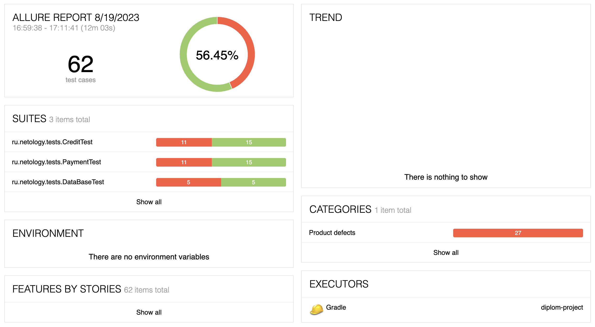
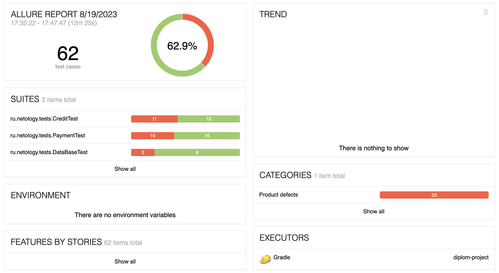

# Отчётные документы по итогам тестирования

## Краткое описание
Реализована автоматизация тестирования комплексоного сервиса для покупки тура в Мараккеш

## Количество тест-кейсов
Общее количество тест-кейсов для обеих СУБД - 62 шт

## Процент успешных и не успешных тест-кейсов
в БД *MySQL:*
> успешных: 56.45%

> неуспешных: 43.55% 

в БД *PostgreSQL:*
> успешных: 62.9%

> неуспешных: 37.1% 

## Общие рекомендации
По обнаруженным дефектам созданы *Issues:* баг-репорты и рекомендации по улучшению. Баг-репорты необходимо принять в работу.